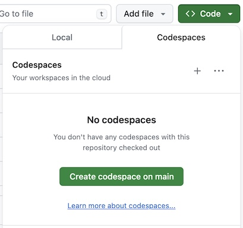

# Union.ai Serverless Workshop

Welcome to the Union.ai Serverless Workshop! In this workshop, we will cover:

1. Setup workspace and connect to Union.ai Serverless
2. Launch a simple ML workflow & get familiar with the Python SDK
3. LLM tracking workflow using HuggingFace and Weights & Bias.
4. Explore models using Union hosted VSCode

## Codespaces on GitHub

1. Go to [serverless-gcp.cloud-staging.union.ai](https://serverless-gcp.cloud-staging.union.ai/) and login with your GitHub account.
2. Fork this repo and navigate to your fork.
3. Click on the Code button, go to the Codespaces tab, click on "Create codespaces on main".

4. In the Codespaces environment, open the `workshop.ipynb` file.

## Google Colab

1. Go to [serverless-gcp.cloud-staging.union.ai](https://serverless-gcp.cloud-staging.union.ai/) and login with your GitHub account.
2. Open [this notebook in Colab](https://colab.research.google.com/github/thomasjpfan/unionai-llm-tracking-workshop/blob/main/workshop.ipynb).
